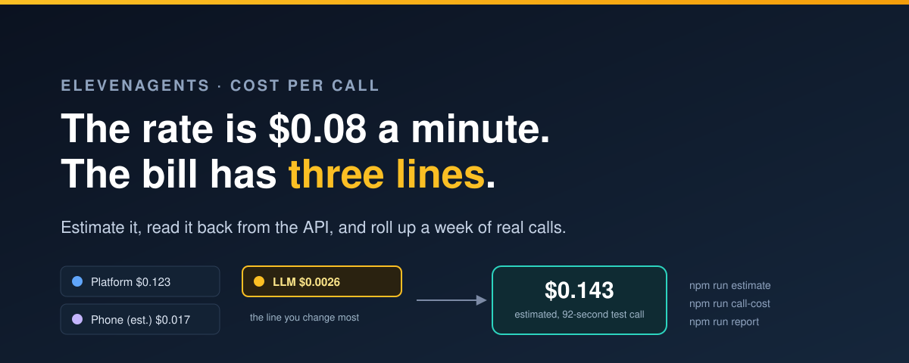
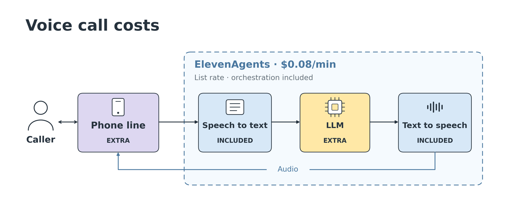
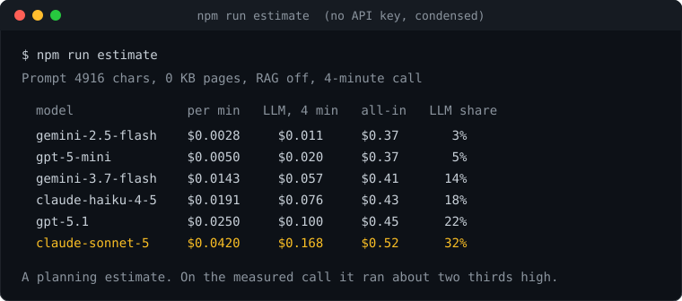
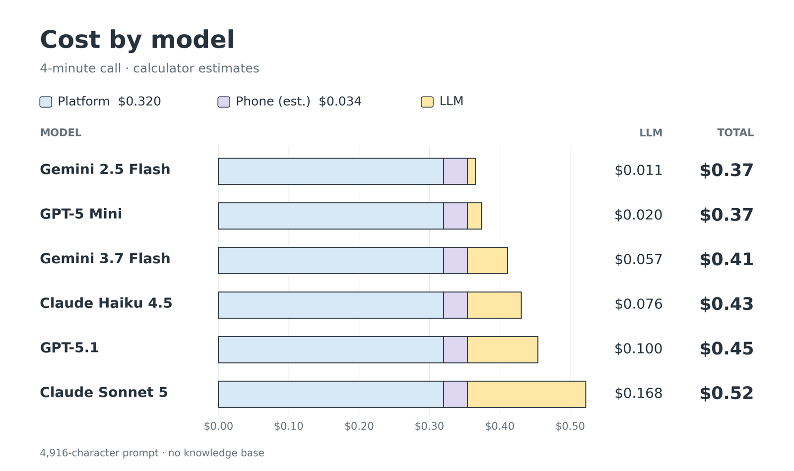

# What one ElevenAgents call actually costs



[](LICENSE)


Companion code for **"Voice agent cost per call: how to read and estimate your ElevenAgents bill"**.

Pricing pages quote a per-minute rate. The bill has three lines:

- the **platform minute**, which covers speech to text, text to speech, and orchestration
- the **LLM**, billed on top by token
- the **phone line**, billed by your carrier

These scripts **estimate** that bill before you deploy, **read it back** from the conversation details endpoint after every call, and **roll it up** over a week of real traffic. Everything uses the official `@elevenlabs/elevenlabs-js` SDK.

> **TL;DR.** A 92-second test call over WebSocket was billed 1.5372 platform minutes and $0.0026 of LLM. Priced at the $0.08 list rate, with a phone line added at Twilio's list rate, that's an **estimated $0.143** for the same call on a phone line. The platform minute is 86% of it, the phone line 12%, and the LLM 2%. Swapping models changes the LLM line by up to 15x, and prompt caching kicked in with nothing configured. `npm install`, then `npm run estimate` works immediately, with no API key.



> **What's measured and what's estimated.** The billed minutes, LLM price, and token counts come from one test call's record, so read them as a worked example, not a benchmark. The platform line is priced at the list rate, not the plan's own credit valuation. The phone line is hypothetical, because the test ran over WebSocket and no carrier was involved. Point `npm run report` at a week of your own traffic before you put a number in a budget.

## Contents

- [What's here](#whats-here)
- [Run it](#run-it)
- [What you should see](#what-you-should-see)
- [Notes & gotchas](#notes--gotchas)

## What's here

| Path | What it is | Needs a key | Spends anything |
|------|-----------|:---:|:---:|
| `src/estimate.ts` | LLM cost per model for your prompt, from ElevenLabs' cost calculator | No | No |
| `src/call-cost.ts` | One call's cost: platform and LLM from the record, phone line estimated, LLM tokens, cache share, and an optional raw-API estimate | Yes | No |
| `src/report.ts` | One row per call for the last N days, with totals and an optional CSV | Yes | No |
| `src/create-agent.ts` | The test agent: a support line with one `lookup_order` webhook tool | Yes | No |
| `src/scripted-call.ts` | Places a real call over the conversation WebSocket with six scripted customer lines | Yes | About 1.5 call minutes |
| `src/lib/cost.ts` | `callCost()` and `rawApiReprice()`, shared by the scripts, plus the list prices in `RATES` | | |
| `agent/prompt.md` | The 4,916-character support-agent system prompt | | |
| `agent/customer-lines.txt` | The six scripted customer lines | | |

## Run it

Requires Node 20.12 or later (there's an `.nvmrc` for Node 22). An `ELEVENLABS_API_KEY` is only needed from step 2 on.

```bash
# 0. Clone and install
git clone https://github.com/mostafaibrahim17/elevenagents-cost-per-call
cd elevenagents-cost-per-call
npm install

# 1. Estimate before you deploy. No key needed.
npm run estimate
npm run estimate -- --pages 12            # with a 12-page knowledge base
npm run estimate -- --pages 100 --rag     # with a 100-page knowledge base and RAG on

# 2. Configure
cp .env.example .env                      # add your ElevenLabs API key

# 3. Create the test agent, then place one scripted call
npm run create-agent                      # prints the agent ID
npm run scripted-call -- <agent_id>       # prints the conversation ID

# 4. Read the bill back, and re-price it from the raw APIs.
#    0.006 is this test call's LLM line at Google's Gemini 2.5 Flash list price. Use your own call's figure.
npm run call-cost -- <conversation_id> --provider-llm 0.006

# 5. Once real traffic arrives, roll up a week
npm run report -- <agent_id> --days 7 --csv out/report.csv
```

The scripts load `.env` automatically, or read `ELEVENLABS_API_KEY` from your environment. `npm run typecheck` checks the whole project under strict TypeScript.

## What you should see

`npm run estimate` prices the same prompt across six models for a four-minute call. The captures below are condensed, with the table borders and some lines trimmed.



`npm run call-cost` reads the call's record and shows which lines are measured and which are estimated. The full output also prints the recorded `cost_fiat` and any silence or burst charges.


- **The platform minute is most of the cost.** At list rate it's $0.123 of the estimated $0.143. With the cheapest model the LLM is 2%.
- **Caching happens by itself.** Cache reads were 23% of input tokens on the test call, with nothing configured.
- **The raw APIs cost less per call, not less overall.** Priced from Scribe, Flash, and Gemini list rates, the same usage comes to an estimated $0.070. The gap of about 4.7 cents a minute pays for turn-taking, streaming, tool calling, and hosting.



## Notes & gotchas

- **Budget at the list rate.** On the Free plan the record values platform minutes below $0.08, and shows zero free minutes consumed. The pricing page doesn't say how credits convert to dollars. `call-cost` shows both figures.
- **The calculator tends to run high.** On the test call it came out above the LLM price in the record, because it assumes more messages a minute. The estimator on the pricing page, at its default setting, runs lower. Treat the two as a range.
- **Silence and burst minutes are listed separately.** Voice minutes are priced at the $0.08 list rate. If the record bills other platform categories, such as silence at 5% of the rate or burst minutes, `call-cost` lists them as the record priced them and adds them to the platform line.
- **The phone line isn't in `costFiat`.** It's your carrier's charge. The scripts estimate it at Twilio's US inbound rate, rounded up to whole minutes as Twilio bills it. A WebSocket test call doesn't incur it.
- **`ttsUsage` and `asrUsage` are analytics fields.** The docs say so. They're what make the raw-API comparison possible, but they aren't billing lines.
- **Caching on a model that charges for it.** On Claude Sonnet 5 ($2.20 per 1M fresh input tokens, $0.22 cached, $2.75 to write the cache), the test call scaled to four minutes is about 50,000 input and 1,570 output tokens, or about $0.13 with nothing cached. About 38,700 of those input tokens were fresh and 11,500 were Gemini cache reads, which Sonnet 5 would charge for unless its own cache catches them. The prompt was about three quarters of each generation's input, so caching it after the first turn moves (38,700 − 1,670) × 0.75, about 27,800 tokens, to a tenth of the price. With the one-off write of about $0.003, the call comes to about $0.05. That assumes Sonnet 5's cache also catches the 11,500 tokens Gemini served from cache. If they're charged fresh, it's nearer $0.08. Counted generation by generation, as the prompt's share falls, it's nearer $0.06.
- **Past about 55 pages, the knowledge base costs more than the model.** At 12 pages the RAG flag makes no difference to the estimate. At 100 pages without RAG, Sonnet 5 reaches $4.34 a call. With RAG it's $1.21. Run `npm run estimate -- --pages <n>` with and without `--rag` for your own size.
- **English agents need a Flash v2 or Turbo v2 voice model.** The API rejects Flash v2.5 for an English agent, which is why `create-agent` uses `eleven_flash_v2`.
- **Why the SDK and not the CLI.** `@elevenlabs/cli` manages agents as config files, which suits teams that keep agents in git. This repo creates its one test agent with the SDK so the whole project runs on a single dependency.
- **Prices move.** The list prices for the estimated totals and raw-API figures live in `RATES` in `src/lib/cost.ts`, as read on 28 September 2026. Check them before you rely on them.

## License

MIT
